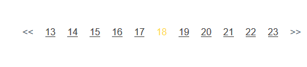

## A simple page paginator for vue

### Install

    yarn add vue-page-pagination

or

    npm i vue-page-pagination --save


### Useage

    import Paginator from 'vue-page-pagination';

with a simple style

    import 'vue-page-pagination/simple.css';


in Vue:

```html
<paginator
    :total="934"
    :perPage="20"
    :segment="5"
    previous="<<"
    next=">>"
    @change="pageChange"
></paginator>
```

the `pageChange` callback function receive current page index args.


